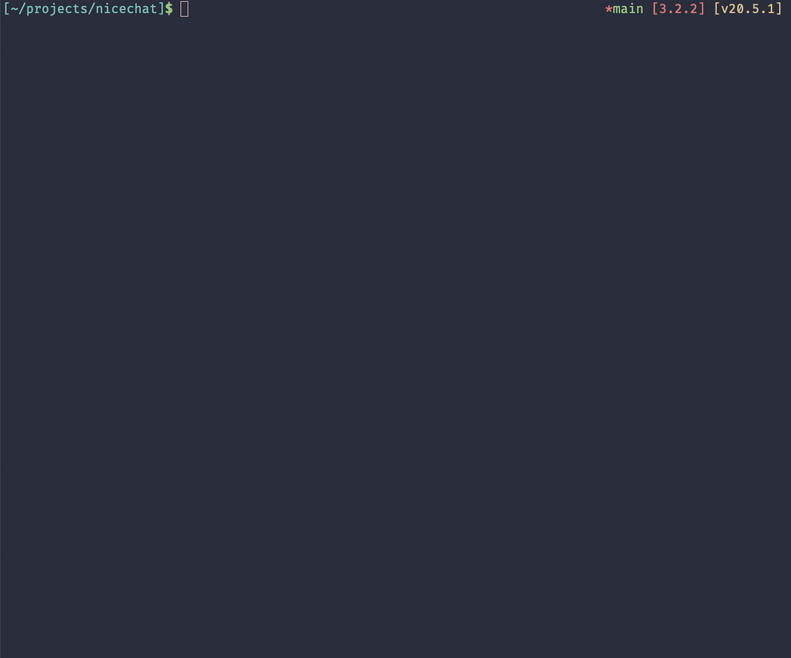

# nicechat

An extensible command-line chat for OpenAI's models.



## How to use it?

Create a configuration file at `~/.nicechat.json`.

```json
{
  "openai_key": "<YOUR OPEN_AI TOKEN>",
  "model": "gpt-3.5-turbo",
  "system": "You are a helpful chatbot. You answer straight and to the point. With no bullshit."
}
```

Start the chat:

```
$ nicechat
```

## Settings

There are just three options for now:

- `openai_key` - your OpenAI key required to communicate with OpenAI Apis. [Find it here](https://platform.openai.com/account/api-keys). Don't forget to control your spendings.
- `model` - one of the GPT models. You can list available models with `nicechat list-models`.
- `system` - sets up the initial role of your assistant.

## Built-in plugins

Nicechat comes with several useful plugins that are basically just [functions](https://platform.openai.com/docs/guides/gpt/function-calling) that run on your machine.

### WebsiteFetcher

WebsiteFetcher fetches contents of some website (only textual content). It can be used with GPT's ability to summarize content.

### UrlOpener

Opens any URL in your default browser.

### CurrentTime

Returns users's current time and date.

## Building your own plugins

You can write your own plugins.

Browse [plugins](https://github.com/hiquest/nicechat/tree/main/src/plugins) for inspiration.

To be written.
