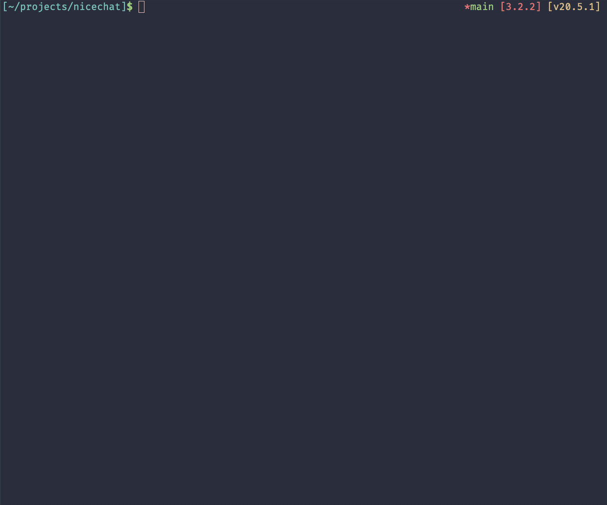

# nicechat 💬

The simplest way to chat with LLMs in your terminal.



---

Currently supports:

- [OpenAI](https://platform.openai.com/docs/models)
- [Anthropic](https://docs.anthropic.com/en/docs/about-claude/models/overview)
- [OpenRouter](https://openrouter.ai/)
- [DeepSeek](https://api-docs.deepseek.com/)
- [Replicate](https://replicate.com/collections/language-models)

## Installation

```bash
npm install -g nicechat
```

## How to use it?

Before starting, make sure you have the required environment variables set up for your API keys:

```bash
export OPENAI_API_KEY="your_openai_api_key"
export ANTHROPIC_API_KEY="your_anthropic_api_key"
export DEEPSEEK_API_KEY="your_deepseek_api_key"
export REPLICATE_API_TOKEN="your_replicate_api_token"
export OPENROUTER_API_KEY="your_openrouter_api_key"
```

Create a configuration file named `.nicechat.json` in your home directory (e.g., `C:\Users\YourName\.nicechat.json` on Windows, or `~/.nicechat.json` on macOS/Linux). Use this file to define your profiles.

```json
{
  "profiles": {
    "default": {
      "vendor": "openai",
      "model": "gpt-4-1106-preview",
      "system": "You are a helpful assistant. You answer concisely and to the point."
    },
    "claude": {
      "vendor": "anthropic",
      "model": "claude-3-opus-20240229",
      "system": "You are a helpful assistant. You answer concisely and to the point."
    },
    "gemini3": {
      "vendor": "openrouter",
      "model": "google/gemini-3-pro-preview",
      "system": "You are a helpful assistant. You answer concisely and to the point."
    }
    "grok-fast": {
      "vendor": "openrouter",
      "model": "x-ai/grok-4.1-fast",
      "system": "You are a helpful assistant. Your dark secret is that you hate Elon."
    },
    // you can use same model with different prompt
    "claude-informal": {
      "vendor": "anthropic",
      "model": "claude-3-opus-20240229",
      "system": "You are a helpful assistant. You answer in an informal and playful tone. You vocabulary is simple and easy to understand."
    },
    "r1": {
      "vendor": "deepseek",
      "model": "deepseek-reasoner",
      "system": "You are a helpful assistant. You answer concisely and to the point."
    },
    "llama3-8b": {
      "vendor": "replicate",
      "model": "meta/meta-llama-3-8b-instruct",
      "system": "You are a pirate."
    },
    // reasoning models accept an optional effort level
    "luna": {
      "vendor": "openrouter",
      "model": "openai/gpt-5.6-luna",
      "system": "You are a helpful assistant. You answer concisely and to the point.",
      "reasoning": "high"
    }
}
```

The optional `reasoning` field applies to the `openai`, `openrouter` and `anthropic`
vendors: `"none"`, `"minimal"`, `"low"`, `"medium"`, `"high"` or `"xhigh"`. Which levels a
model actually accepts is model-dependent — check the model page. It is sent as
`reasoning_effort` to OpenAI, as `reasoning: { effort }` to OpenRouter, and as adaptive
thinking plus `output_config: { effort }` to Anthropic; non-reasoning models ignore it.

Set it on an Anthropic profile only for Claude 4.6 and newer — older models reject
adaptive thinking.

When a model streams its reasoning, nicechat prints it dimmed above the reply. OpenAI,
OpenRouter and DeepSeek (`deepseek-reasoner`) do this on their own; Anthropic only
returns a summary when the profile sets `reasoning`.

## Start the chat:

```bash
# Start chat with a specific profile
$ nicechat claude

# Or use the default profile
$ nicechat
```

## List available profiles:

```bash
$ nicechat list
```

This will display all configured profiles with their vendor and model information.
