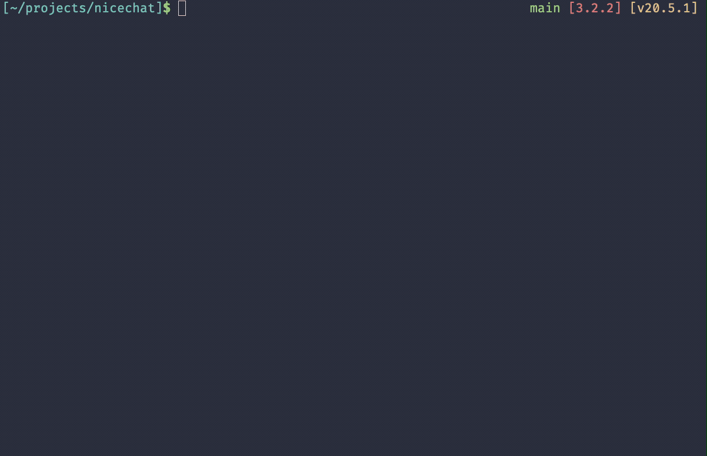

# nicechat

An extensible multi-provider command-line chat.

Currently supports OpenAI, Anthropic and Replicate.



## How to use it?

Create a configuration file at `~/.nicechat.json`.

```json
{
  "openai_key": "...",
  "anthropic_key": "...",
  "replicate_key": "...",
  "profiles": {
    "default": {
      "vendor": "openai",
      "model": "gpt-4-1106-preview",
      "system": "You are a helpful assistant. You answer concisely and to the point."
    },
    "claude": {
      "vendor": "anthropic",
      "model": "claude-3-opus-20240229",
      "system": "You are a helpful assistant. You answer concisely and to the point."
    },
    "llama3-8b": {
      "vendor": "replicate",
      "model": "meta/meta-llama-3-8b-instruct",
      "system": "You are a pirate."
    }
}
```

Start the chat:

```
$ nicechat chat claude
```

or to run the default profile:

```
$ nicechat
```

## Built-in plugins (OpenAI only)

Nicechat comes with several useful plugins that are basically just [functions](https://platform.openai.com/docs/guides/gpt/function-calling) that run on your machine.

### WebsiteFetcher

<details>
  <summary>Show me GIF</summary>

  
</details>

WebsiteFetcher fetches contents of some website (only textual content). It can be used with GPT's ability to summarize content.

### UrlOpener

Opens any URL in your default browser.

### CurrentTime

Returns users's current time and date.

## Building your own plugins

You can write your own plugins.

Browse [plugins](https://github.com/hiquest/nicechat/tree/main/src/plugins) for inspiration.
